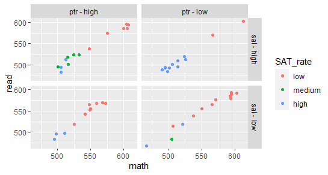
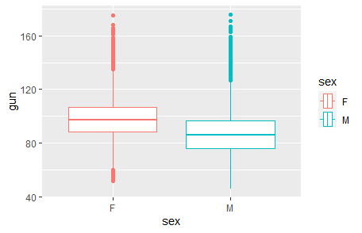
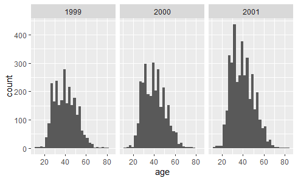
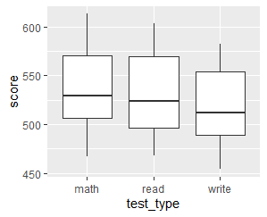
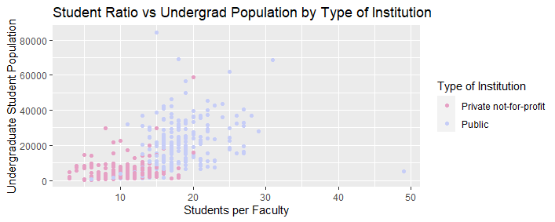
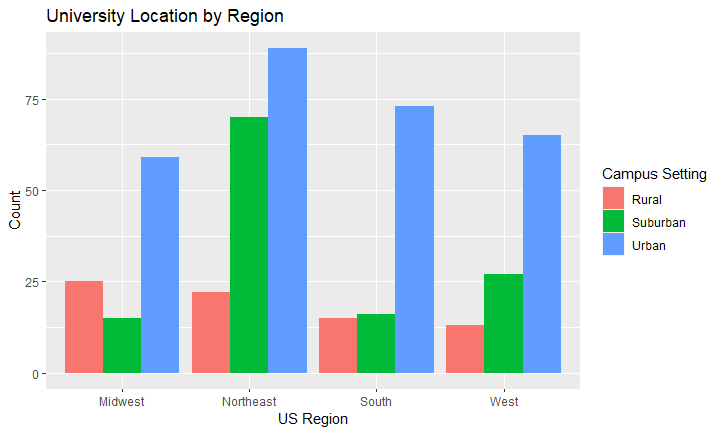
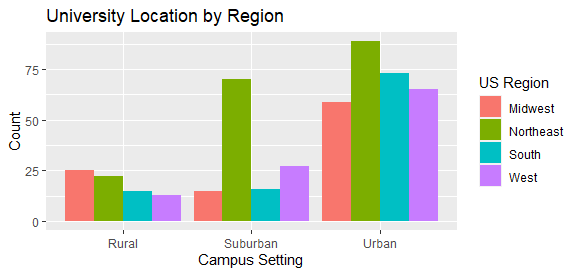

# ggplot2

## Syntax and Structure:

Fundamental components of ggplot2:

* Data Layer: The dataset you're working with.
* Aesthetics Mapping (aes): How data variables map to plot aesthetics like position, color, shape, etc.
* Geometric Objects (geom): The visual elements to represent the data (points, lines, bars, etc.).
* Facets (facet_wrap or facet_grid): Splitting data into subplots based on a variable.
* Theme: Controlling the overall appearance of the plot.

> The key to using ggplot to is to think of every command as a layer like the pipe for `dplyr`


*Data Layer:*
The data layer is where you specify the dataset that you want to visualize. It's the foundation of your plot and determines what information will be represented. In the data layer, you provide the actual data frame or data source you want to use for plotting. This data source should contain the variables you'll use in your plot.

*Aesthetic Layer:*
The aesthetic layer defines how variables from the dataset are visually represented in the plot. It maps data variables to visual properties of the plot such as position, color, size, shape, and transparency. The aesthetic mappings are set using the `aes()` function, which stands for aesthetics.

*Geom Layer:*
The geom layer is responsible for creating the graphical elements that you see on the plot. Each type of visualization, like points, lines, bars, etc., is represented by a different geom. The choice of geom depends on the type of data you have and the story you want to tell.

For example, in a scatter plot, you would map the x and y coordinates of your data to the position of the points on the plot. You might also map a categorical variable to the color of the points and a numeric variable to the size of the points. This aesthetic layer gives visual cues about the relationships and patterns in your data.

    # Assume dataset contains variables 'x' and 'y' (numeric) and 'cat' (categorical)
    ggplot(data = dataset, aes(x = x, y = y, color = cat)) +
      geom_point()  # This is a geometric layer for scatter plot

## Types of Plots

### One Variable Plots (Univariate):
1. Numeric Variables:
* Histogram: Visualize the distribution of a numeric variable.
* Density Plot: Similar to a histogram but with a smooth curve.
* Boxplot: Display the distribution's summary statistics and outliers.
* Violin Plot: Combines a box plot and a density plot.

2. Categorical Variables:
* Bar Plot: Display the frequencies or proportions of different categories. (The only good one!!!)
* Pie Chart: Represent proportions of different categories in a circular format. (Please don't use..)
* Dot Plot: Show individual data points along a category. (Still not very good..)

### Two Variable Plots:

1. Numeric vs. Numeric:
* Scatter Plot: Visualize the relationship between two numeric variables.
* Line Plot: Display (connected) changes over time or another continuous variable.

2. Numeric vs. Categorical (Side-by-Side):
* Box Plot: Compare numeric values across different categories.
* Violin Plot: Compare the distribution of numeric values across categories.
* Bar Plot: Show numeric values within different categories.

3. Categorical vs. Categorical:
* Grouped Bar Plot: Compare frequencies or proportions of multiple categorical variables side by side.
* Stacked Bar Plot: Similar to a grouped bar plot, but bars are stacked.

### Three Variable Plots:
1. Numeric vs. Numeric vs. Categorical:
* Faceted Plot: Create multiple small plots based on a third categorical variable.
* Bubble Plot: Similar to a scatter plot, but with bubbles of varying sizes representing a third variable.

2. Categorical vs. Categorical vs. Numeric:
* Heatmap: Display the relationship between two categorical variables using color intensity.

### Multivariate Plots:
1. Numeric vs. Numeric vs. Numeric:
* 3D Scatter Plot: Visualize the relationship between three numeric variables in three dimensions.
2. Categorical vs. Categorical vs. Categorical:
* Mosaic Plot: Display the relationship between three categorical variables using rectangular tiles.

Remember, the choice of plot depends on the research question, the variables you have, and the story you want to tell with your data. Each type of plot emphasizes different aspects of the data, so it's important to choose the one that effectively communicates the insights you want to convey.

We will only have time to discuss one and two variable plots but with the option to add more aesthetics like color and shape based on categorical information.


## Univariate displays

### Histograms

```{r hist, message=FALSE}
library(mdsr)
library(tidyverse)
data("SAT_2010")

SAT_2010 %>% 
  ggplot(aes(x = math)) +
  geom_histogram()

## can also write like
ggplot(SAT_2010, aes(x = math)) +
  geom_histogram()

## change the break points
SAT_2010 %>% 
  ggplot(aes(x = math)) +
  geom_histogram(breaks = c(400,450,550,600,700))
## change the bins
SAT_2010 %>% 
  ggplot(aes(x = math)) +
  geom_histogram(bins = 10)
```

### Density Plots

```{r density}
SAT_2010 %>% 
  ggplot(aes(x = math)) + 
  geom_density()

#changing the bandwidth to be more jagged
## the smaller the more jagged
SAT_2010 %>% 
  ggplot(aes(x = math)) + 
  geom_density(bw = 10)

```

### Boxplots

```{r boxplots}
SAT_2010 %>% 
  ggplot(aes(x = math)) +
  geom_boxplot()

## sometimes easier to view with a flipped axis
SAT_2010 %>% 
  ggplot(aes(x = math)) +
  geom_boxplot() +
  coord_flip()
```


### Bar Plots
```{r barplot}
## need a categorical variables to count

SAT_2010 %>% 
  mutate(salary_level = case_when(
    salary < 52000 ~ "Low",
    salary >= 52000 & salary < 60000 ~ "Medium",
    salary >= 60000 ~ "High"
  )) %>% 
  ggplot(aes(x = salary_level)) +
  geom_bar()

## notice that it put's it in alphabetical order

SAT_2010 %>% 
  mutate(salary_level = case_when(
    salary < 52000 ~ "Low",
    salary >= 52000 & salary < 60000 ~ "Medium",
    salary >= 60000 ~ "High"
  )) %>% 
  mutate(salary_level = factor(salary_level, levels = c("Low", "Medium", "High"))) %>% 
  ggplot(aes(x = salary_level)) +
  geom_bar()


```


## Multivariate displays

### Scatter plots

```{r scatter}
SAT_2010 %>% 
  ggplot(aes(x = expenditure, y = math)) + 
  geom_point()
```
 
We can easily add a trend line with ggplot.  

```{r scatter_trend}
SAT_2010 %>% 
  ggplot(aes(x = expenditure, y = math)) + 
  geom_point() +
  geom_smooth(method = "lm", se = FALSE) 

## ?geom_smooth
SAT_2010 %>% 
  ggplot(aes(x = expenditure, y = math)) + 
  geom_point() +
  geom_smooth(method = "loess", se = TRUE) 
```


### Color or Shape 

```{r color}
SAT_2010 <- SAT_2010 %>%
  mutate(
    SAT_rate = cut(
      sat_pct, 
      breaks = c(0, 30, 60, 100), 
      labels = c("low", "medium", "high")
    )
  )

SAT_2010 %>% 
  ggplot(aes(x = expenditure, y = math, color = SAT_rate)) +
  geom_point()
## add a trend line to help visually explain differences 
SAT_2010 %>% 
  ggplot(aes(x = expenditure, y = math, color = SAT_rate)) +
  geom_point() +
  geom_smooth(method = "lm", se = FALSE)


## Now try with shape
SAT_2010 %>% 
  ggplot(aes(x = expenditure, y = math, shape = SAT_rate)) +
  geom_point()

## can be hard to see so generally can be combined together
## this is redundant but can help bring the point home
SAT_2010 %>% 
  ggplot(aes(x = expenditure, y = math, color = SAT_rate, shape = SAT_rate)) +
  geom_point()

```

### Faceting

This is similar to using shape or color for a categorical variables but puts them on separate plots.

```{r facet}
SAT_2010 %>% 
  ggplot(aes(x = expenditure, y = math)) +
  geom_point() +
  geom_smooth(method = "lm", se = FALSE) +
  facet_wrap(~ SAT_rate)

## can use 2 categorical variables
SAT_2010 %>% 
  mutate(ptr = ifelse(pupil_teacher_ratio >= 15, "ptr - high","ptr - low")) %>% 
  ggplot(aes(x = expenditure, y = math)) +
  geom_point() +
  geom_smooth(method = "lm", se = FALSE) +
  facet_grid(ptr ~ SAT_rate)
```

### Side-by-Side

```{r sbs}
SAT_2010 %>% 
  ggplot(aes(math, SAT_rate)) +
  geom_boxplot() +
  coord_flip()
```


## On your own..

Make these plots!

Code for SAT_2010 mutate

          mutate(ptr = ifelse(pupil_teacher_ratio >= 15, "ptr - high","ptr - low"), 
                 sal = ifelse(salary >= 52000, "sal - high","sal - low"),
                 SAT_rate = cut(
            sat_pct,
            breaks = c(0, 30, 60, 100),
            labels = c("low", "medium", "high")
          ))
  
  


Now try using the `Cherry` dataset. Explore it and try to make these maps.





## Guides and Themes in ggplot2

### Guides
In ggplot2, guides are visual elements that help interpret the scales used in a plot. Guides include legends, color scales, size scales, and more. They provide critical information about the mapping between data and aesthetics in a plot. Two common functions for customizing guides are `scale_fill_manual` and `scale_color_manual.`

#### `scale_fill_manual` and `scale_color_manual`
`scale_fill_manual` and `scale_color_manual` are functions used to manually specify colors for fill and color aesthetics, respectively.
They allow you to provide a set of color values to map discrete data values to specific colors.
Useful when you want to customize the colors used in your plot to match your data or create a particular visual effect.

Example (using scale_fill_manual): Notice we wrapped variables in a `factor()`

```{r scale_fill}
ggplot(data = mtcars, aes(x = factor(cyl))) +
  geom_bar(fill = "dodgerblue") 

ggplot(data = mtcars, aes(x = factor(cyl), 
                          fill = factor(gear)))+
  geom_bar()

ggplot(data = mtcars, aes(x = factor(cyl), 
                          fill = factor(gear)))+
  geom_bar()+
  scale_fill_manual(values = c("red", "green", "blue"))
```

### Themes
Themes in ggplot2 allow you to control the overall appearance of your plot, such as fonts, colors, and gridlines. You can customize the theme of your plot using the theme function.

ggplot2 provides several built-in themes that you can use to change the overall appearance of your plots. These themes offer different combinations of fonts, colors, and gridlines to suit various visualization needs. Here are a few basic themes that come with ggplot2:

1. theme_gray():
* This is the default theme in ggplot2.
* It uses a simple gray background with white gridlines.
* A good choice when you want a clean, minimalist look for your plot.

2. theme_bw():
* This theme provides a white background with black gridlines.
* It offers a high-contrast, black-and-white appearance.
* Useful for creating plots that need to be easily readable in black and white.

3. theme_minimal():
* As the name suggests, this theme is minimalistic.
* It removes gridlines and most background elements, leaving a clean, white canvas.
* Suitable for plots where you want to focus on the data without distractions.

4. theme_void():
* This theme removes nearly all elements, providing a blank canvas.
* It's useful when you want to start with a clean slate and add custom elements.


### Using External Color Packages
Sometimes, you may want to use specialized color palettes from external packages to enhance your data visualizations. Packages like `wesanderson` and `viridis` provide aesthetically pleasing color palettes that can make your plots more visually appealing.

Example (using the viridis package):

```{r viridis}
library(viridis)
library(palmerpenguins)

ggplot(data = penguins, aes(x = bill_length_mm, y = bill_depth_mm, color = species)) +
  geom_point()


ggplot(data = penguins, aes(x = bill_length_mm, y = bill_depth_mm, color = species)) +
  geom_point() +
  scale_color_viridis(discrete = TRUE) 
```

### Customizing Labels with labs()
The `labs()` function in ggplot2 allows you to customize plot labels, including titles, subtitles, captions, and axis labels. You can use `labs()` to change the text displayed in various parts of your plot.

Example (customizing plot labels):

```{r labs}
ggplot(data = penguins, aes(x = bill_length_mm, y = bill_depth_mm, color = species)) +
  geom_point() +
  labs(
    title = "Scatter Plot of Bill Length vs. Bill Depth",
    x = "Length of Bill (mm)",
    y = "Depth of Bill (mm)",
    subtitle = "Data from the PalmerPenguins dataset",
    caption = "Source: Penguin Data"
  )
```

## Homework
1. Using the `Teams` data frame in the Lahman package:
 (5 points) Create a scatterplot of strikeouts (SO) vs walks (BB) faceting by Rank 1-5. What do you see? 
Create a categorical variable with 4 levels: before 1900, 1900-1949, 1950-1999, 2000 or later. (Hint: There is a function called 'cut' that will help you here.) Use this as the color of the point in the scatterplot of strikeouts vs walks that you created in the previous problem. Now what do you see?


2. Using the `flights` data frame in the nycflight13 package:
 (5 points) Create side-by-side boxplots of delay times if a flight was scheduled to leave before noon or afternoon (use 1200 for the time) for the top 5 airlines (in terms of number of flights).

3. Using `top_colleges_2022` recreate these images.

a)  (5 points) I am using the wes anderson pallet "GrandBudapest2".



b)  (10 points) Create these two plots and report what stands out from each one.


